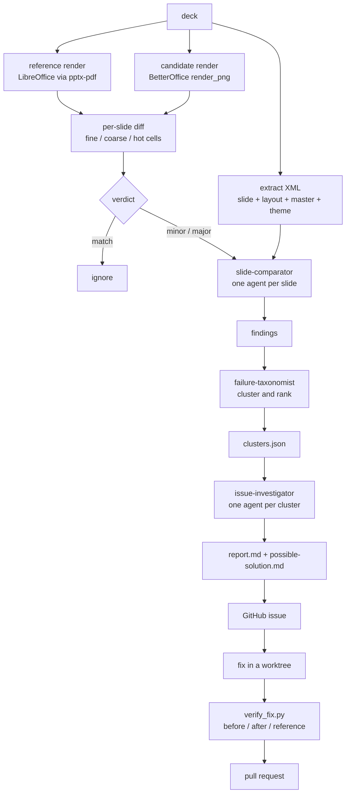

# betteroffice-meta-harness

A differential rendering harness for [BetterOffice](https://github.com/openooxml/betteroffice)'s
PowerPoint renderer. It renders the same deck twice — once with a reference implementation, once
with BetterOffice — compares the two per slide, clusters what it finds into distinct renderer
defects, and turns each cluster into an upstream issue and a pull request.

This repository holds the method and the code. It holds **no decks and no renders**: the sample
decks are third-party copyrighted files, and their renders stay on the machine that produced them.

## Why differential

A renderer has no ground truth you can assert against. What it does have is another renderer that
has been wrong in different ways for twenty years. Rendering the same deck through both and
diffing the pixels turns "does this look right?" into "where do these two disagree?", which is a
question a machine can ask a thousand times an hour.

The diff is a lead, not a verdict. Every disagreement is investigated against the OOXML in the
deck and the code in the crates before it becomes an issue, because the reference is wrong often
enough to matter.

## The loop

Stages 1–5 are deterministic scripts. The judgement stages are subagents, because "what is wrong
with this slide" and "are these two findings the same defect" are not things a diff can answer.

## Layout

| path | what it is |
|---|---|
| `scripts/` | the deterministic pipeline — register a deck, render both sides, extract XML, diff, collect, index, verify a fix, file an issue |
| `agents/` | the three subagents: per-slide comparator, taxonomist, per-cluster investigator |
| `skills/` | the skill that drives the loop |
| `templates/` | the report and issue shapes the agents fill in |
| `docs/` | the dependency-ordered fix plan, the fix loop, and the failure taxonomy |

## The two renderers

**Reference — [`pptx-pdf`](https://github.com/dsaad68/pptx-pdf).** A CLI that drives an embedded
LibreOffice to rasterise a deck to PNG at a chosen DPI, with a font directory and hidden-slide
support. Written for this harness, because driving `soffice` directly is slow and its output paths
are not stable enough to diff against.

**Candidate — BetterOffice's own slide rasterizer.** `render_png` did not exist when this started;
it was [added upstream](https://github.com/openooxml/betteroffice/pull/264) as part of this work,
precisely so the renderer could be measured. It is what makes the candidate side of the diff
possible, and every fix in the loop is verified through it.

Both sides render at 96 dpi with Liberation, Carlito and Caladea aliased to the metric-compatible
Microsoft families, so text is shaped with the same metrics on both sides and a diff means a
layout difference rather than a font difference.

## Reading the numbers

The per-pixel percentage is a triage signal, not a score. Three ways it misleads, all seen:

- A correct fix can raise it. Text drawn at its proper size diverges more from a reference whose
  own line breaking differs than the wrong-sized text did.
- A fix landing before its dependency can raise it. Resolving a group fill gives custom-geometry
  shapes a fill they lacked, and each paints as its bounding box until the geometry parser lands.
- Small correct changes barely move it. Removing twelve stray digits from a chart is about 123
  pixels on a 1280×720 slide.

Judge a fix against the issue's own verification section, and look at the render.

## Provenance

Deck sources, licences and every render are tracked outside this repository. Two of the decks used
during development carry confidentiality markings and are not redistributed; published evidence
comes only from design templates whose slides carry placeholder content.
